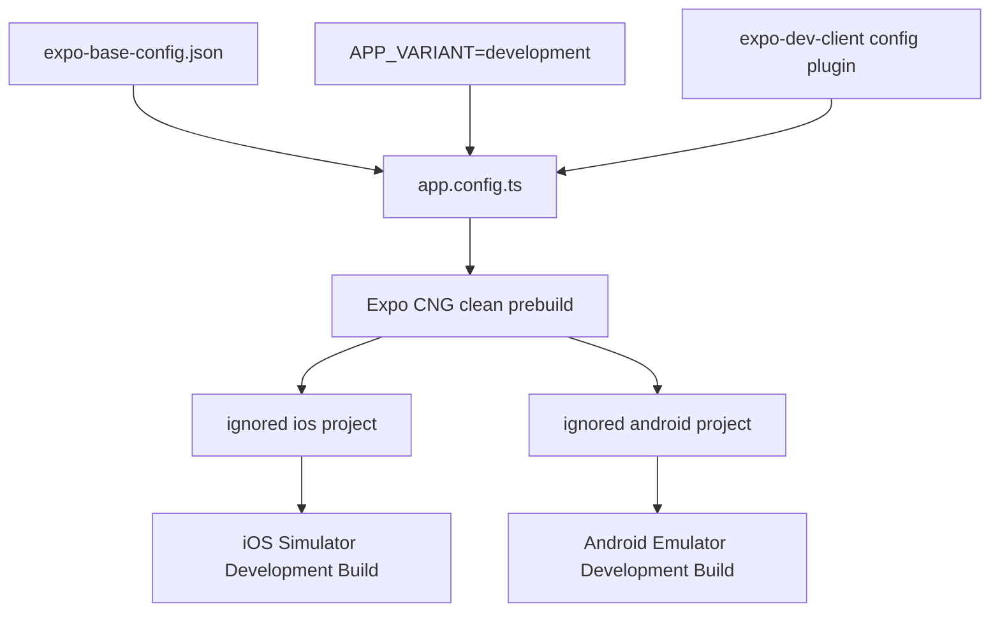

# ADR 0004: M3 앱 기반을 고정하고 preference persistence 선택을 보류한다

- 상태: Accepted
- 결정일: 2026-08-26
- 적용 마일스톤: M3 이후
- 대체하는 결정: 없음

## 맥락

M2는 Expo SDK 57 default template과 Bun 기준선만 제공했다. M3는 Expo Development Build와
CNG를 실제 앱 구조에 연결하고, 후속 offline-first 채팅 구현이 들어갈 module boundary와
품질 기준을 만들어야 한다. 하지만 아직 실제 사용자 preference, server contract, auth,
SQLite, chat 또는 realtime state가 없다.

지금 state library나 persistence owner를 선택하면 존재하지 않는 제품 state를 기준으로
수명주기와 migration을 먼저 고정하게 된다. 반대로 variant, generated native ownership,
route/module boundary, local fixture, theme와 test runner는 M3 코드의 동작과 검증 방식에 이미
직접 영향을 주므로 명시적인 결정이 필요하다.

## 결정

### Development-only variant와 exact Expo base

`src/core/config/expo-base-config.json`을 SDK 57 template에서 보존한 non-identity Expo
설정의 단일 base fragment로 사용한다. `app.config.ts`는 base를 통째로 유지하고 development
variant에서 다음 네 identity 값과 development-client plugin만 추가한다.

| 필드                  | 값                   |
| --------------------- | -------------------- |
| name                  | `Jamye Development`  |
| slug                  | `jamye-development`  |
| iOS bundle identifier | `dev.local.jamyeapp` |
| Android package       | `dev.local.jamyeapp` |

`APP_VARIANT`가 없거나 알 수 없는 값이면 실패한다. `preview`와 `production`도 구성 전에는
명시적으로 실패하며 development identity로 fallback하지 않는다. Production identifier,
signing과 EAS resource는 이 결정에 포함하지 않는다.

`expo-dev-client`에는 `{ addGeneratedScheme: true }`만 설정한다. 이 scheme은 generated
development launcher plumbing이며 공개 custom scheme, universal link 또는 app link 계약이
아니다. 공개 deep-link 계약은 제품 route와 redirect allowlist가 정해진 뒤 별도로 결정한다.

### CNG가 native project를 소유한다

`app.config.ts`, imported base JSON, installed Expo/React Native version과 config plugin이 native
configuration의 원본이다. `/ios`와 `/android`는 ignored CNG output으로 유지하고 직접
수정하거나 commit하지 않는다.

Native-code dependency를 추가·update·remove하거나 config plugin 또는 native app-config
field를 바꾸면 clean prebuild와 iOS·Android Development Build를 모두 다시 수행한다. JS/TS만
바뀌고 기존 native binary와 호환될 때만 Metro reload로 기존 client를 재사용한다.



### Active module boundary와 local fixture

M3에서 실제로 활성화하는 경계는 다음과 같다.

- `src/app`: 얇은 Expo Router route와 root composition
- `src/core/config`: Expo base와 public environment validation
- `src/core/logging`: structured redacted local logger
- `src/core/errors`: root Error Boundary와 accessible retry
- `src/core/providers`: startup validation과 provider composition
- `src/core/theme`: semantic token과 system theme provider
- `src/features/development-fixture`: deterministic in-memory fixture model과 화면
- `src/shared/ui`: React Native core 기반 screen/text primitive

Root composition은 `AppErrorBoundary -> AppProviders -> AppThemeProvider -> Expo Router Stack`
순서다. Route는 DB, HTTP, token refresh, WebSocket 또는 persistence를 직접 소유하지 않는다.

M3 fixture는 exact in-memory constant이며 `local-fixture` mode와 production server에 연결되지
않았다는 안내를 표시한다. Server, auth, session, storage, random/time 기반 transport를
가장하지 않는다. Repository-wide ESLint policy는 `app.config.ts`와 모든 `src` TS/TSX에서
직접 `fetch`, `XMLHttpRequest`, `WebSocket`, `EventSource`, `NetInfo`와 low-level transport
module을 금지한다. Route와 UI에는 persistence와 HTTP client를 포함한 더 좁은 import 금지를
추가한다.

### System dark mode와 preference 보류

Light/dark palette는 semantic token으로 정의하고 React Native `useColorScheme()`을 통해 system
appearance를 따른다. M3에는 theme preference를 저장하지 않으며 Zustand를 포함한 generic
state library도 추가하지 않는다.

첫 번째 실제 preference가 생길 때 다음을 함께 판단하는 새 ADR을 작성한다.

- preference가 사용자별인지 installation별인지
- logout·계정 전환 때 무엇을 정리하는지
- schema migration, backup·restore와 stale value 처리
- 여러 화면의 반응성과 offline 접근 요구

그때 비교할 구체적인 persistence 후보는 다음과 같다.

1. SQLite preferences table: 기존 transactional data와 migration을 공유하지만 작은 UI 설정에
   DB lifecycle 비용을 부과한다.
2. AsyncStorage 같은 작은 KV: 단순 preference에는 가볍지만 사용자 scope, migration과 logout
   정리를 별도로 설계해야 한다.
3. Zustand 같은 memory state: session-only UI state에는 적합하지만 앱 재시작 뒤 persistence를
   제공하지 않으며 persistence adapter를 다시 선택해야 한다.

요구가 생기기 전에는 어느 후보도 설치하거나 state owner로 선언하지 않는다.

### Jest 단일 runner와 application coverage

Jest 29와 `jest-expo` preset을 Expo/React Native test의 유일한 runner로 사용한다. 이는
`oma-refactor`의 generic TS/JS registry가 Vitest를 기본으로 제안하는 규칙에 대한 이
repository의 명시적 예외다. Expo module transform, React Native environment와 preset
behavior를 같은 runner에서 검증해야 하므로 generic web-oriented runner보다 `jest-expo`가
현재 구조에 맞는다.

Vitest config나 dependency를 추가하지 않고 Jest와 다른 runner를 병행하지 않는다. 이 선택은
승인된 M3 PLAN과 `G-M3-DEPENDENCY-INSTALL`에서 허용됐다. Runner를 재검토하려면 실제
호환성·성능 문제, 별도 ADR, 새로운 dependency 승인과 quality 계약 승인이 모두 필요하다.

Application coverage denominator는 정확히 다음과 같다.

```text
app.config.ts
src/**/*.{ts,tsx}
!src/**/*.d.ts
```

`!src/**/*.d.ts`는 denominator 내부의 유일한 declaration negative glob이며 현재 보존된
`src/types/expo.d.ts`에는 실행 가능한 branch가 없기 때문이다. 다음 runner/checker 파일은
application/runtime 코드가 아니어서 denominator 밖에 둔다.

- `eslint.config.js`: lint runner configuration이며 exact policy binding은 architecture checker와
  실제 lint command가 검증한다.
- `jest.config.js`: test runner configuration이며 exact 구조와 실행 결과를 별도로 검증한다.
- `tools/quality/check-architecture.cjs`: repository invariant checker이며 pure export를 fixture로
  test하되 application coverage numerator를 부풀리지 않는다.

Tests도 application denominator에 넣지 않는다. Jest는 `tests/`만 test root로 사용하며
`passWithNoTests`를 허용하지 않는다. Global statements, branches, functions, lines는 모두 80%
이상이어야 하고 local `/coverage/` output은 ignored 상태로 유지한다.

## 선택하지 않은 대안

### M3에서 persisted theme preference 구현

사용자가 선택할 theme preference와 사용자 scope가 아직 없다. System appearance만으로 M3
dark-mode foundation을 검증할 수 있는데 persistence lifecycle까지 먼저 고정하므로 선택하지
않았다.

### 미래 state를 위해 generic state library 선설치

현재 provider와 fixture는 React context와 immutable local constant로 충분하다. 사용처 없이
library를 추가하면 dependency와 ownership만 늘고 어떤 state를 맡을지는 설명하지 못한다.

### Preference store를 미리 선택

SQLite, small KV와 memory state는 migration, logout, restart persistence에서 서로 다른
tradeoff를 가진다. 첫 preference 요구 없이 하나를 선택할 근거가 없어 보류했다.

### Vitest로 교체하거나 Jest와 병행

Expo/React Native preset과 현재 component test 환경을 둘로 나누면 transform, mock과 coverage
결과가 runner마다 달라진다. 단일 품질 기준을 약화하고 유지 비용을 늘리므로 선택하지 않았다.

### Generated native project를 source control에 포함

CNG 원본과 generated file을 동시에 수정하는 두 ownership model이 생긴다. Config plugin으로
표현할 수 없는 native 변경이 실제로 누적될 때 별도 ADR로 전환 여부를 결정한다.

## 결과

- Development identity와 native regeneration 조건이 명확해진다.
- Preview/production은 잘못 development로 build되지 않고 configuration 단계에서 실패한다.
- Route, core, feature, shared UI의 현재 책임과 deferred module 경계가 구분된다.
- Local fixture나 test가 production server 연결을 가장하지 않는다.
- System dark mode를 제공하면서 preference persistence와 state library 선택 비용을 미룬다.
- Jest 하나가 Expo-native component와 aggregate application coverage를 측정한다.
- Native dependency/config 변경은 양 플랫폼 clean regeneration/rebuild 비용을 발생시킨다.
- M3만으로 chat/data/E2E, production readiness, native build 또는 runtime 성공을 보장하지 않는다.

## 후속 검증

- `app.config.ts`가 imported base를 정확히 보존하고 development identity/plugin만 더하는지
  config test와 architecture checker로 검증한다.
- Missing/unknown/preview/production variant와 invalid public mode가 controlled failure인지
  config/environment test로 검증한다.
- ESLint가 전체 measured source의 transport와 coverage-ignore directive를 차단하고 route/UI의
  강화된 boundary를 유지하는지 검증한다.
- `jest.config.js`의 exact denominator, sole declaration negative glob과 네 80% threshold를
  architecture checker와 aggregate coverage run으로 검증한다.
- Native dependency/config 변경 뒤 ignored CNG output을 clean regenerate하고 양 플랫폼
  Development Build를 다시 만든다.
- Build/install과 별도로 현재 Metro bundle을 사용하는 두 session·세 runtime 관찰을 수행한다.

위 항목은 실행 절차다. 이 ADR은 품질 command, prebuild, iOS/Android build 또는 runtime
관찰이 이미 통과했다고 주장하지 않는다.

## 근거

- `app.config.ts`
- `src/core/config/expo-base-config.json`
- `src/core/config/public-env.ts`
- `eslint.config.js`
- `jest.config.js`
- `tools/quality/check-architecture.cjs`
- [`README.md`](../../README.md)
- [`docs/roadmap.md`](../roadmap.md)
- M3 PLAN approval과 `G-M3-DEPENDENCY-INSTALL`
